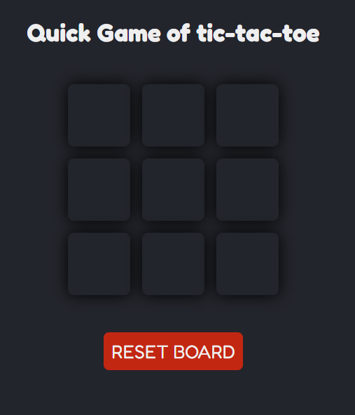
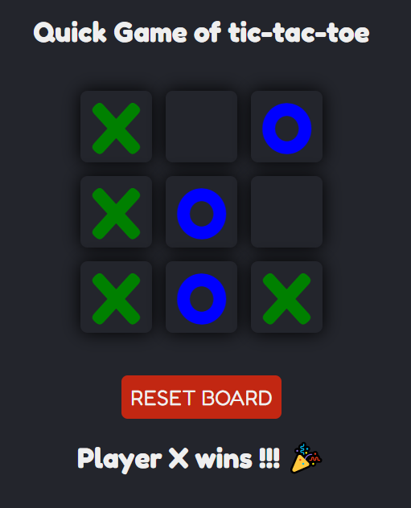

# This is a simple tic tac toe game to practice my newly learned React skills
 
 ## This is the start-up screen of the game:

 

 

 #
 
 ## How to play the game

1. Click on the box that you want to fill, the sign will change automatically.
2. Try to have three of your signs in a column or row or even diagonally to win
3. If nobody wins and all the 9 boxes are filled then the game is draw

#

## The screen when a player wins:

 

 

#

## The screen when nobody wins hence the game is draw:

 

 

#

### To try the game click [here](https://tic-tac-toe-kg.netlify.app/).

